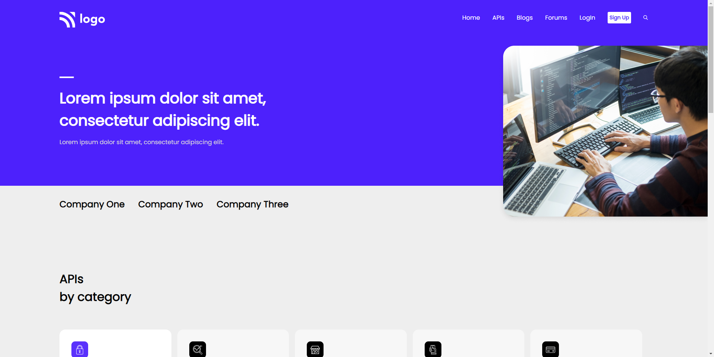

# HTML  and CSS 

# Project 9 - Developer Landing Page 

By Maulik Vadodariya

## [Link to the live Project](https://developer-landing-page.netlify.app/)

## What I learned from this Project?

- I have done this project using `HTML` and `CSS` only.
- Responsive design and full end to end project.

## I spent 10 to 12 hours in making this project

